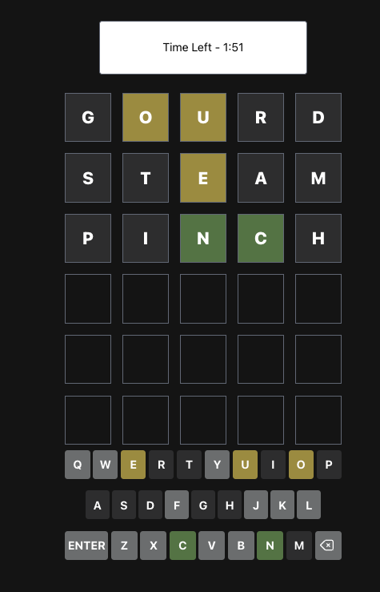

# Arcadle

Hi, I'm Aaron and like the rest of the world, I was swept up in the wordle craze during the pandemic. Sharing the game results with friends on a near daily basis had been a huge source of fun for me. That being said, it was a brief experience that left me wanting more. So, created Arcadle with the goal of a site that gave you reason to spend more time playing wordle. 

## Game Modes

### Wordle

This is your classic wordle game. The only difference being that it is the main way to earn currency, which you can use to play other games. 

### Survivle

Survivle involves a game where you play as many games of wordle as you can in 5 minutes. Winning gives you +30s and losing is -10s. Costs 1 coin to play. 

### Gamble (Under Construction)

Gamble is where you can get your big points! You can choose a word with a length of 6-10 characters, 1-6 guesses, and 1 to as many coins as you have. 

<figure>
  <figcaption><strong>Wordle</strong></figcaption>
  
</figure>

<figure>
  <figcaption><strong>Survivle</strong></figcaption>
  
</figure>

<figure>
  <figcaption><strong>Leaderboard</strong></figcaption>
  
</figure>

## Technologies Used:
- HTML
- CSS
- JavaScript/Node
- React
- Express
- Tailwind
- MongoDB/Mongoose

